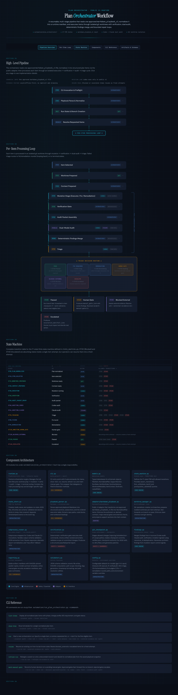

# plan-orchestrator

Run approved AI repo changes one item at a time in isolated git worktrees, with verification, dual audits, and explicit human/external stop points.

Plan Orchestrator is a boring, auditable runtime for repo-change control. A human reviews one Markdown playbook, the runtime normalizes it into a machine-readable plan, each item runs in its own worktree, verification happens before audit, and the run stops cleanly at manual gates, scope violations, or missing external evidence.

## Why this exists

Most coding-agent workflows optimize for autonomy. This repo optimizes for control:

- one reviewed `markdown_playbook_v1` file as the public input contract
- one orchestrator-owned worktree per item attempt
- verification before either audit lane
- Codex + Claude auditing the same frozen packet
- deterministic findings merge before triage
- explicit `passed`, `awaiting_human_gate`, `blocked_external`, and `escalated` terminals
- local/offline-first defaults and no agent-owned git operations

## Fastest way to understand it

**Tier 1: no-credential inspection**

```bash
python automation/run_plan_orchestrator.py list-items \
  --playbook examples/launch_demo_playbook/playbook.md

python automation/run_plan_orchestrator.py show-item \
  --playbook examples/launch_demo_playbook/playbook.md \
  --item 01 \
  --format text
```

The launch-oriented demo under `examples/launch_demo_playbook/` is intentionally small and direct:

- item `01` is a clean `passed` path
- item `02` stops in `awaiting_human_gate`
- item `03` stops in `blocked_external` until you resume with local evidence

Need the deeper behavioral example immediately? Inspect item `02` in `examples/basic_markdown_playbook/playbook.md`.

**Tier 2: full run with proof capture**

See:

- `docs/demo-run.md` — exact commands for the launch demo and proof bundle capture
- `docs/launch-proof.md` — real excerpts and captures from the March 26, 2026 demo runs
- `examples/launch_demo_playbook/README.md` — shortest repeatable walkthrough
- `examples/basic_markdown_playbook/README.md` — deeper sequential example with a dependency-ordered behavioral item
- `docs/comparison.md` — comparison against the obvious baselines

## What this is not

- not a planner that invents work
- not a generic chat shell
- not a web-browsing agent
- not a fire-and-forget loop that silently pushes through human or external blockers

## Comparison at a glance

| comparator | stronger there | where plan-orchestrator is stronger |
|---|---|---|
| Claude Code | interactive coding convenience, direct git workflows, broad tool surface | approved-input discipline, worktree-per-item isolation, verification before dual audit, explicit stop states |
| OpenHands | broader SDK/CLI/cloud surface and platform breadth | smaller, more legible repo-change control model and local/offline-first posture |
| SWE-agent | issue-solving lineage, CLI/trajectory workflow, benchmark framing | reviewed playbook input, dual audit over a frozen packet, explicit human/external terminals |
| GitHub Actions | repo-native automation and organizational familiarity | agent-aware mutation, verification, audit, merged findings, and triage semantics |
| manual `git worktree` + CLI agent + CI | lower abstraction and maximum flexibility | repeatable structure, preserved artifacts, deterministic findings merge, bounded repair loops |

## The core runtime is intentionally boring

- one orchestrator-owned worktree per item attempt
- direct ingestion of one approved `markdown_playbook_v1` file
- normalization into `normalized_plan.json` before any item executes
- `codex exec` as the mutation lane for execute, fix, and remediation
- verification before either audit lane
- dual audit over a frozen audit packet:
  - `codex exec`
  - `claude -p`
- deterministic merged findings before triage
- bounded fix and remediation loops
- explicit `awaiting_human_gate`, `blocked_external`, and `escalated` terminals
- conservative auto-advance to the next unfinished item only after a clean pass

## Examples

Two example surfaces ship in-repo:

- `examples/launch_demo_playbook/` — the launch-oriented, pass-first demo surface for README readers and Show HN proof capture
- `examples/basic_markdown_playbook/` — the deeper example showing a manual gate, a behavioral item with explicit Red/Green verification wiring, and a blocked-external resume path

## Canonical input contract

The public v1 authoring contract is `markdown_playbook_v1`.

You provide one parser-safe markdown file with a required `## 2. Ordered Execution Plan` pipe table keyed by `step_id`. The runtime snapshots that markdown, normalizes it into `normalized_plan.json`, and executes the normalized plan.

See:

- `docs/playbook-contract.md`
- `docs/operator-guide.md`

## Intentional v1 layout

This public repo intentionally keeps the engine under `automation/plan_orchestrator/` and the launcher at `automation/run_plan_orchestrator.py`.

That is a deliberate packaging choice for v1:

- the repo stays checkout-runnable without an installation step,
- prompt and schema assets keep stable relative paths,
- operator commands stay short and explicit,
- the transfer package stays close to the proven in-repo implementation.

## Workflow visual

For a quick architecture pass, use the rendered workflow visual:

- preview image: `docs/assets/plan_orchestrator_workflow.png`
- source HTML: `docs/plan_orchestrator_workflow.html`

The image is the fastest way to understand the runtime at a glance.
The HTML version is the maintainable source artifact and works best when opened in a browser.

<p>
  <a href="docs/plan_orchestrator_workflow.html">
    
  </a>
</p>

## Full-run prerequisites

The no-credential inspection path above only needs Python and the repo checkout.

A full `run`, `resume`, or `mark-manual-gate` walkthrough expects:

- Python 3.10, 3.11, or 3.12
- `git`, `bash`, `codex`, and `claude` available in `PATH`
- Git identity configured for checkpoint commits
- a clean tracked checkout
- no unreviewed ambient agent configuration unless you intentionally acknowledge it

See `docs/operator-guide.md` for the exact preflight behavior and environment checks.

## Quick start

List items:

```bash
python automation/run_plan_orchestrator.py list-items \
  --playbook path/to/playbook.md
```

Show one item:

```bash
python automation/run_plan_orchestrator.py show-item \
  --playbook path/to/playbook.md \
  --item 01
```

Run the first unfinished item:

```bash
python automation/run_plan_orchestrator.py run \
  --playbook path/to/playbook.md \
  --next
```

Run a named item:

```bash
python automation/run_plan_orchestrator.py run \
  --playbook path/to/playbook.md \
  --item 01
```

Run multiple items in explicit order:

```bash
python automation/run_plan_orchestrator.py run \
  --playbook path/to/playbook.md \
  --items 01,02,03
```

Resume a prior run:

```bash
python automation/run_plan_orchestrator.py resume \
  --run-id RUN_20260325T120000Z_deadbeef
```

Record a manual-gate decision:

```bash
python automation/run_plan_orchestrator.py mark-manual-gate \
  --run-id RUN_20260325T120000Z_deadbeef \
  --item 01 \
  --decision approved \
  --by "Reviewer Name" \
  --note "Required review completed." \
  --evidence-path docs/reviews/signoff.md
```

## Local artifact layout

Run-control artifacts:

```text
.local/automation/plan_orchestrator/runs/<RUN_ID>/
```

Model JSON reports:

```text
.local/ai/plan_orchestrator/runs/<RUN_ID>/
```

Per-item worktrees:

```text
.local/automation/plan_orchestrator/worktrees/<RUN_ID>/item-<ITEM_ID>-attempt-<N>/
```

Worktree-visible packet for local artifacts:

```text
<WORKTREE>/.local/plan_orchestrator/packet/
```

## Safety defaults

The runtime is reproducibility-first and local/offline-first by default.

That means:

- no agent-owned git operations
- no implicit web browsing by execution, audit, triage, fix, or remediation
- no automatic continuation past manual gates or external blockers
- no destructive reset/clean/rebase/squash automation
- only a passed item, or an item later approved through a manual gate, can advance the run branch

## Package self-check

After copying the repo into its standalone home, run:

```bash
python -m unittest discover -s automation/plan_orchestrator/tests -t .
```

Capture that command's output as the package verification record for the extracted repo.

## Operator notes

- Verification is a first-class stage. It runs after each mutation stage and before audit.
- Audit always operates on a frozen packet plus candidate patch.
- Findings are merged deterministically before triage.
- Repair loops are bounded by configuration; defaults remain 2 fix rounds plus 1 remediation round.
- External evidence must be supplied as local files. The runtime does not browse the web to satisfy external-evidence gates.
