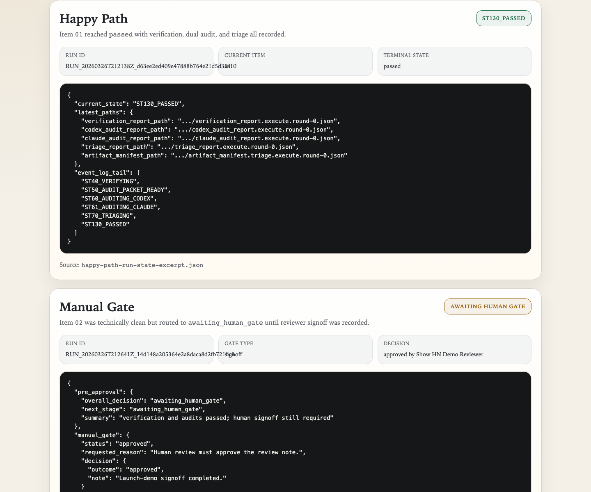
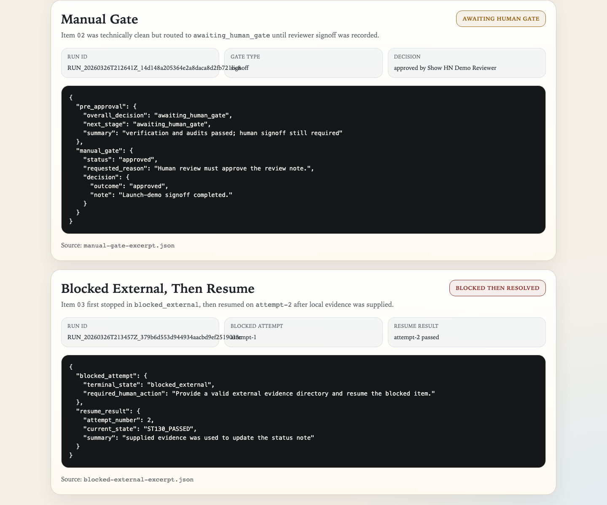
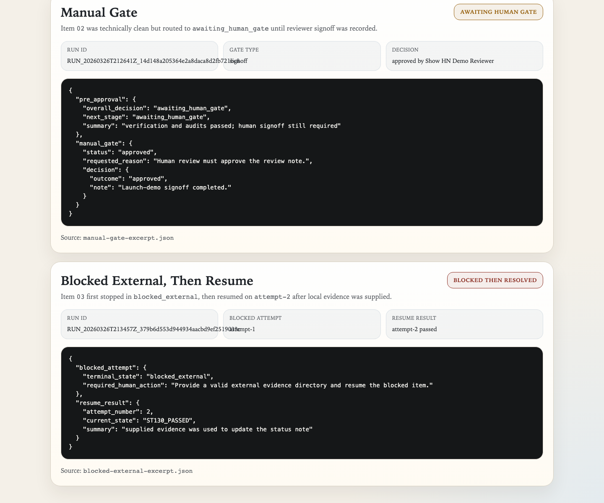

# Launch Proof

This note captures the real proof surface generated on March 26, 2026 against commit `e36a115`.

The runs below were executed from the launch demo in `examples/launch_demo_playbook/` after the approved Show HN package landed. Because this is a maintainer workstation with reviewed ambient agent config present, the full-run commands used the documented local acknowledgment path `PLAN_ORCHESTRATOR_CLEAN_ENV_CONFIRMED=1`.

## What was captured

- one happy-path run that reached `passed`
- one manual-gate run that stopped in `awaiting_human_gate` and then moved to `passed` after `mark-manual-gate`
- one blocked-external run that stopped in `blocked_external` and then moved to `passed` on `attempt-2` after `resume --external-evidence-dir ...`

## Run IDs

- item `01` happy path: `RUN_20260326T212138Z_d63ee2ed409e47888b764e21d5d3aa10`
- item `02` manual gate: `RUN_20260326T212641Z_14d148a205364e2a8daca8d2fb721bc8`
- item `03` blocked external then resume: `RUN_20260326T213457Z_379b6d553d944934aacbd9ef2519033c`

## Visible Captures

Happy path:



Manual gate:



Blocked external:



## Real Excerpts

Happy path excerpt:

```json
{
  "run_id": "RUN_20260326T212138Z_d63ee2ed409e47888b764e21d5d3aa10",
  "current_state": "ST130_PASSED",
  "current_item_id": "01",
  "terminal_state": "passed"
}
```

Manual-gate excerpt:

```json
{
  "run_id": "RUN_20260326T212641Z_14d148a205364e2a8daca8d2fb721bc8",
  "overall_decision": "awaiting_human_gate",
  "gate_type": "signoff",
  "decision": "approved"
}
```

Blocked-external excerpt:

```json
{
  "run_id": "RUN_20260326T213457Z_379b6d553d944934aacbd9ef2519033c",
  "terminal_state": "blocked_external",
  "resume_attempt": 2,
  "final_state": "ST130_PASSED"
}
```

Checked-in excerpt files:

- `docs/assets/show-hn-demo/happy-path-run-state-excerpt.json`
- `docs/assets/show-hn-demo/manual-gate-excerpt.json`
- `docs/assets/show-hn-demo/blocked-external-excerpt.json`

## Why this matters

These artifacts prove the launch claim with real repo outputs rather than hand-written examples:

- the no-credential path exists and matches the docs
- a direct item run reaches `passed`
- the runtime stops cleanly at a required human gate
- the runtime stops cleanly when external evidence is missing
- the blocked item resumes on a fresh attempt when evidence is supplied

The raw source artifacts used to create these public excerpts remain under local `.local/automation/plan_orchestrator/runs/` and `.local/ai/plan_orchestrator/runs/`; they were not checked in wholesale.
